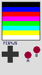
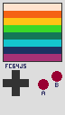
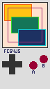
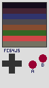
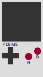
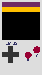

# fc64js - custom palette

fc64js supports up to 8 colors

The default palette offers the 3-bit RGB colors - black and white, the RGB primary colors red, green, and blue, and their complementary colors cyan, magenta, and yellow. The colors in index order from 0 to 7 are black, blue, red, magenta, green, cyan, yellow, and white, and convenient constants referencing these indexes are available (```COL_BLK```, ```COL_BLU```, ```COL_RED```, ```COL_MAG```, ```COL_GRN```, ```COL_CYN```, ```COL_YEL```, ```COL_WHT```)

This minimal rom draws the default palette:

```js
function romInit() {
  for (let i = 0; i < 8; i++) {
    drawRectangle(0, i * 8, 64, 8, i, i);
  }
}

function romLoop() {}
```



## Overriding the default palette

Limiting yourself to just the default palette can be a fun challenge, but coupled with the low 64x64 pixel display resolution it may at times be *too* limiting

There is the option of setting a custom palette on a per rom basis - still only 8 colors, but colors of your choosing

Simply override the ```romPalette``` array to set the desired colors:

```js
romPalette = [0xffe2ce, 0xf56214, 0xffc414, 0x3bd827, 0x147658, 0x14c4ce, 0x1d3162, 0xa73176]; // 4pi

function romInit() {
  for (let i = 0; i < 8; i++) {
    drawRectangle(0, i * 8, 64, 8, i, i);
  }
}

function romLoop() {}
```



It's easy to lose track of which index relates to each color, so you may wish to add a palette enum for convenience:

```js
romPalette = [0xffe2ce, 0xf56214, 0xffc414, 0x3bd827, 0x147658, 0x14c4ce, 0x1d3162, 0xa73176]; // 4pi
const palette = { peach: 0, orange: 1, yellow: 2, lime: 3, green: 4, cyan: 5, navy: 6, plum: 7 };

function romInit() {
  drawRectangle(2, 2, 40, 24, palette.orange, palette.yellow);
  drawRectangle(12, 20, 40, 24, palette.lime, palette.green);
  drawRectangle(22, 38, 40, 24, palette.cyan, palette.navy);
  drawRectangle(7, 7, 50, 50, palette.plum);
}

function romLoop() {}
```



## Providing more than 8 colors

Note that 8 colors is an intentional limitation of fc64js. ```romPalette``` can be set to a larger array of colors, but only the first 8 will be considered by the console's initialization code

This minimal rom shows the first 8 colors of the provided 16 being set as the rom's palette:

```js
romPalette = [0x140c1c, 0x442434, 0x30346d, 0x4e4a4e, 0x854c30, 0x346524, 0xd04648, 0x757161, 0x597dce, 0xd27d2c, 0x8595a1, 0x6daa2c, 0xd2aa99, 0x6dc2ca, 0xdad45e, 0xdeeed6]; // db16

function romInit() {
  for (let i = 0; i < 8; i++) {
    drawRectangle(0, i * 8, 64, 8, i, i);
  }
}

function romLoop() {}
```



Trying to draw a color beyond the 8 color limit to screen results in an error and the rom fails to load:

```js
romPalette = [0x140c1c, 0x442434, 0x30346d, 0x4e4a4e, 0x854c30, 0x346524, 0xd04648, 0x757161, 0x597dce, 0xd27d2c, 0x8595a1, 0x6daa2c, 0xd2aa99, 0x6dc2ca, 0xdad45e, 0xdeeed6]; // db16

function romInit() {
  for (let i = 0; i < 16; i++) {
    drawRectangle(0, i * 4, 64, 4, i, i);
  }
}

function romLoop() {}
```



## Providing less than 8 colors

If less than 8 colors are provided in ```romPalette``` the remaining indexes default to black (0x000000):

```js
romPalette = [0x702963, 0xffbf00]; // bitzantine

function romInit() {
  for (let i = 0; i < 8; i++) {
    drawRectangle(0, i * 8, 64, 8, i, i);
  }
}

function romLoop() {}
```



## Overriding the palette post-initialization

The color palette is configured during fc64js initialization i.e. before control is handed over to the main loop that repeatedly calls ```romLoop```

Any attempt to change the color palette after initialization will fail

In the following example ```romPalette``` is initially set to yellow/purple, then there's an attempt to override to peach/navy in ```romLoop``` - note that it is the original yellow/purple palette that is later drawn to screen:

```js
romPalette = [0x702963, 0xffbf00]; // bitzantine (yellow/purple)

function romInit() {}

function romLoop() {
  romPalette = [0xfacab8, 0x242234]; // peachykeen (peach/navy)
  for (let i = 0; i < 8; i++) {
    drawRectangle(0, i * 8, 64, 8, i, i);
  }
}
```


## Custom palettes and fc64Init()

When using modules and calling ```fc64Init()``` the optional ```romPalette``` parameter should be set:

```js
import 'fc64js';

const romPalette = [0xffe2ce, 0xf56214, 0xffc414, 0x3bd827, 0x147658, 0x14c4ce, 0x1d3162, 0xa73176]; // 4pi
fc64Init(romInit, romLoop, romPalette);

function romInit() {
  for (let i = 0; i < 8; i++) {
    drawRectangle(0, i * 8, 64, 8, i, i);
  }
}

function romLoop() {}
```
