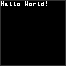

# fc64js - Tutorial - Snake (js)

## Project setup

The simplest way to get started would be to use inline javascript in a html file that references the latest version of the fc64js library hosted on github. Simply create a file named ```snake.html``` and in your text editor or IDE paste in the following boilerplate:

```html
<!DOCTYPE html>
<html>
  <head>
    <meta charset="utf-8" />
    <title>snake</title>
    <meta name="viewport" content="width=device-width, height=device-height, user-scalable=no, initial-scale=1, maximum-scale=1" />
    <script src="https://theinvader360.github.io/fc64js/lib/fc64.min.js"></script>
    <script>
      function romInit() {
        drawText(0, 0, 'Hello World!', COL_WHT);
      }

      function romLoop() {
      }
    </script>
  </head>
  <body>
  </body>
</html>
```

If you want to work offline simply download the latest version of the [fc64js library](https://github.com/TheInvader360/fc64js/blob/main/lib/fc64.min.js) and update the ```script src``` value accordingly

If you want to keep your html and javascript separate you can replace the second ```script``` element with e.g. ```<script src="./main.js"></script>``` and move the script content into a separate file (e.g. ```main.js```)

If all has been done correctly, when you open your ```snake.html``` file in a web browser you will be presented with a familiar greeting...



[Full code at this point](versions/v01.html)

[**Continue to the next step**](02.md)

---

Jump to step: [Introduction](readme.md) | Project setup | [Creating the snake](02.md) | [Drawing the snake](03.md) | [Moving the snake](04.md) | [Throttling the speed](05.md) | [Input handling](06.md) | [Placing the fruit](07.md) | [Eating the fruit](08.md) | [Losing the game](09.md) | [Managing state](10.md) | [Playing sound effects](11.md) | [Distribution](12.md)

