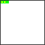

# fc64js - Tutorial - Snake (js)

## Drawing the snake

Let's add a ```draw``` function to the ```Snake``` object:

```js
class Snake {
  ...
  draw() {
    for (const segment of this.body) {
      drawRectangle(segment.x * 4, segment.y * 4, 4, 4, COL_GRN, COL_YEL);
    }
    drawRectangle(this.body[0].x * 4, this.body[0].y * 4, 4, 4, COL_GRN, COL_GRN);
  }
}
```

When called, this function will loop over all segments of the ```Snake```'s ```body```, drawing a 4x4 pixel rectangle for each one, with the top left corner being at that segment's coordinates multiplied by 4 in each direction. The rectangles have a green edge and are filled with yellow. The ```Snake```'s "head" (```body[0]```) is a special case and is overdrawn with a green fill color to distinguish it from the rest of the body

Note that ```drawRectangle``` requires ```x```, ```y```, ```width```, ```height```, and ```edgeColor``` arguments to be provided. The final ```fillColor``` parameter is optional. If no ```fillColor``` is specified, only the edge is drawn, and whatever is "under" the rectangle will remain visible through its "transparent" inner area. All the arguments provided should be integers, and convenient constants that reference the default color palette are available (```COL_BLK```, ```COL_BLU```, ```COL_RED```, ```COL_MAG```, ```COL_GRN```, ```COL_CYN```, ```COL_YEL```, ```COL_WHT```)

Let's add a global variable (```snake```) to hold our ```Snake``` instance, instantiate and initialise it in ```romInit```, and clear the screen then ```draw``` the ```snake``` in the main ```romLoop``` (which is called each tick, ideally 60 times per second)

Note that ```clearGfx``` accepts an optional ```clearColor``` argument. If no ```clearColor``` value is provided the palette's zero index color is used by default (so in our case, using the default palette, that would be black)

```js
let snake;

function romInit() {
  snake = new Snake();
  snake.init();
}

function romLoop() {
  clearGfx(COL_WHT);
  snake.draw();
}
```

If we refresh the browser we'll see a snake with its head at coordinate (2,0) and its remaining body segments at (1,0) and (0,0):



[Full code at this point](versions/v03.html)

[**Continue to the next step**](04.md)

---

Jump to step: [Introduction](readme.md) · [Project setup](01.md) · [Creating the snake](02.md) · Drawing the snake · [Moving the snake](04.md) · [Throttling the speed](05.md) · [Input handling](06.md) · [Placing the fruit](07.md) · [Eating the fruit](08.md) · [Losing the game](09.md) · [Managing state](10.md) · [Playing sound effects](11.md) · [Bug fixing](12.md) · [Distribution](13.md)
