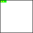

# fc64js - Tutorial - Snake (js)

## Moving the snake

Let's add an ```update``` function to the ```Snake``` object:

```js
class Snake {
  ...
  update() {
    for (let i = this.body.length - 1; i > 0; i--) {
      this.body[i].x = this.body[i - 1].x;
      this.body[i].y = this.body[i - 1].y;
    }
    const head = this.body[0];
    head.x = wrap(head.x + this.direction.x, 0, 16);
    head.y = wrap(head.y + this.direction.y, 0, 16);
  }
}
```

On each ```update``` all segments of the snake's ```body``` excluding the head, working from the tip of the tail up towards the head, have their coordinates set to those of the next segment up. The head itself is positioned at its existing position plus whatever the current direction happens to be (so if moving right the head moves one position to the right, and so on). When positioning the head the new coordinates are screen wrapped using the ```wrap``` function provided by fc64js

Note that ```wrap``` requires ```value```, ```minExclusive```, and ```maxExclusive``` arguments to be provided. The first argument is the value we are wrapping (in this case an x or y coordinate), the second argument is the lowest acceptable value for that variable (in this case 0 - the top-left corner of our game world is positioned at (0,0)), and the third argument is the first value that exceeds the maximum acceptable value for that variable (in this case 16 - the bottom-right corner of our game world is positioned at (15,15))

We need to call ```update``` from ```romLoop```, updating the ```snake``` before we ```draw``` it:

```js
function romLoop() {
  clearGfx(COL_WHT);
  snake.update();
  snake.draw();
}
```

If we refresh the browser we'll see a snake that moves (very quickly) across the screen:



[Full code at this point](versions/v04.html)

[**Continue to the next step**](05.md)

---

Jump to step: [Introduction](readme.md) · [Project setup](01.md) · [Creating the snake](02.md) · [Drawing the snake](03.md) · Moving the snake · [Throttling the speed](05.md) · [Input handling](06.md) · [Placing the fruit](07.md) · [Eating the fruit](08.md) · [Losing the game](09.md) · [Managing state](10.md) · [Playing sound effects](11.md) · [Distribution](12.md)
