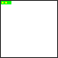

# fc64js - Tutorial - Snake (js)

## Throttling the speed

We can slow our `snake` down by updating its state less frequently. Rather than call `update` each time `romLoop` is called (i.e. updating on each tick, usually 60 times per second), we can keep track of the tick count and only call `update` every "n" ticks (e.g. every 10 ticks)

We'll add a global `ticks` variable for our counter, and initialise it with a value of 0. Then each time `romLoop` is called we'll increment the `ticks` count, and only `update` the snake if the `ticks` count is cleanly divisible by 10:

```js
let ticks = 0;

function romLoop() {
  ticks++;
  clearGfx(COL_WHT);
  if (ticks % 10 == 0) {
    snake.update();
  }
  snake.draw();
}
```

If we refresh the browser we'll see a snake that moves at a more reasonable speed:



[Full code at this point](versions/v05.html)

[**Continue to the next step**](06.md)

---

Jump to step: [Introduction](readme.md) · [Project setup](01.md) · [Creating the snake](02.md) · [Drawing the snake](03.md) · [Moving the snake](04.md) · Throttling the speed · [Input handling](06.md) · [Placing the fruit](07.md) · [Eating the fruit](08.md) · [Losing the game](09.md) · [Managing state](10.md) · [Playing sound effects](11.md) · [Bug fixing](12.md) · [Distribution](13.md)
