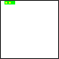

# fc64js - Tutorial - Snake (js)

## Input handling

To help keep things readable, let's add a call out to a new ```handleGameplayInput``` function from ```romLoop```:

```js
function romLoop() {
  ticks++;
  clearGfx(COL_WHT);
  handleGameplayInput();
  ...
```

And let's create that ```handleGameplayInput``` function:

```js
function handleGameplayInput() {
  if (isJustPressed(BTN_U)) {
    snake.tryUp();
  }
  if (isJustPressed(BTN_D)) {
    snake.tryDown();
  }
  if (isJustPressed(BTN_L)) {
    snake.tryLeft();
  }
  if (isJustPressed(BTN_R)) {
    snake.tryRight();
  }
}
```

So on each tick we'll check if any of the buttons we are interested in (up/down/left/right) has just been pressed, and if so call the relevant method on our ```snake``` instance

Note that these button presses could have originated from a keyboard, touch controls, or physical gamepad - the ```isJustPressed``` method detects them all (there is no need to query various input devices separately). It is also worth noting that ```isPressed``` and ```isJustReleased``` functions are also available - we won't be needing them in this particular project but it could be useful information for future reference

Let's add the ```tryUp```, ```tryDown```, ```tryLeft```, and ```tryRight``` functions to the ```Snake``` object:

```js
class Snake {
  ...
  tryUp() {
    if (this.direction.y == 0) {
      this.direction.x = 0;
      this.direction.y = -1;
    }
  }
  tryDown() {
    if (this.direction.y == 0) {
      this.direction.x = 0;
      this.direction.y = 1;
    }
  }
  tryLeft() {
    if (this.direction.x == 0) {
      this.direction.x = -1;
      this.direction.y = 0;
    }
  }
  tryRight() {
    if (this.direction.x == 0) {
      this.direction.x = 1;
      this.direction.y = 0;
    }
  }
}
```

If trying to set the ```direction``` to up or down, first check that we're not already moving on the vertical plane (to avoid redundancy and prevent suicidal 180 degree u-turns), and provided we're not set the ```direction``` as requested (negative ```y``` value for up and positive ```y``` value for down as our coordinate system has its origin at the top left corner). Similarly, if trying to set the ```direction``` to left or right, we first check the current direction on the horizontal plane then if safe to do so go on to set the direction as requested

If we refresh the browser we'll see that we can now control our snake:



[Full code at this point](versions/v06.html)

[**Continue to the next step**](07.md)

---

Jump to step: [Introduction](readme.md) | [Project setup](01.md) | [Creating the snake](02.md) | [Drawing the snake](03.md) | [Moving the snake](04.md) | [Throttling the speed](05.md) | Input handling | [Placing the fruit](07.md) | [Eating the fruit](08.md) | [Losing the game](09.md) | [Managing state](10.md) | [Playing sound effects](11.md) | [Distribution](12.md)

