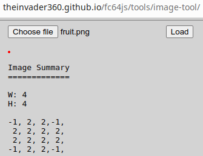
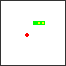

# fc64js - Tutorial - Snake (js)

## Placing the fruit

The aim of the game is to grow the snake as long as you can. The snake only grows when it eats some fruit, so let's add some fruit!

We could draw our fruit as a rectangle (or square), but there are times we want to draw something a little more detailed. fc64js offers various drawing functions - we could easily draw our fruit using a number of ```drawPixel``` calls, or a couple of ```drawRectangle``` calls, or a ```drawPattern``` call, but we're going to use ```drawImage``` instead

We're working with 4x4 pixel elements in our game, so fitting the fruit into the same constraints makes sense. I summoned up all of my artistic abilities and came up with this magnificent piece of programmer art:


Note that the image above is scaled up by a factor of 10 - the real image (that you can save a copy of) is here:


fc64js doesn't deal with image files directly, instead it works with arrays of integers where each value references a color in the palette. Up to eight colors can be defined in a palette, and the default values for indices 0 to 7 are black, blue, red, magenta, green, cyan, yellow, and white. For each pixel in the ```drawImage``` bounds (a rectangle defined by ```x```, ```y```, ```width```, and ```height``` parameters), a value is pulled from the provided ```pixelColors``` array and drawn to screen via internal calls to ```drawPixel```. Images are read in the same order as the screen is drawn i.e. from left to right and top to bottom. Any attempt to draw a pixel with a color value outside the valid 0 to 7 range results in no pixel being drawn (in effect a transparent pixel) - by convention -1 is used for intentionally transparent pixels

Armed with this knowledge it should be fairly straightforward to translate our ```fruit.png``` into a ```pixelColors``` array suitable for use by the ```drawImage``` function. Translating larger and more complex images would soon become tedious, and that's where the fc64js [image-tool](https://theinvader360.github.io/fc64js/tools/image-tool/) comes in useful - simply upload a png file (e.g. your previously saved ```fruit.png```) to generate fc64js friendly ```pixelColor``` values:

[](https://theinvader360.github.io/fc64js/tools/image-tool/)

To draw our fruit image in the top left corner of the screen we'd simply plug those values (and ```x``` and ```y``` screen coordinate values of zero) into a ```drawImage``` call like so:

```js
drawImage(0, 0, 4, 4, [-1, 2, 2, -1, 2, 2, 2, 2, 2, 2, 2, 2, -1, 2, 2,-1]);
```

Bringing all that into our game, let's first define an ```imgFruit``` constant to hold our pixel data (not strictly necessary, but it helps make the code more readable):

```js
const imgFruit = [
  -1, 2, 2,-1,
   2, 2, 2, 2,
   2, 2, 2, 2,
  -1, 2, 2,-1,
];
```

Then we'll add a global variable (```fruit```) to hold another ```Vec2``` instance that records the fruit's location within the game world, and initialise it in ```romInit``` to any valid location (i.e. anywhere between world coordinates (0,0) and (15,15) inclusive):

```js
let fruit;

function romInit() {
  ...
  fruit = new Vec2(randomInt(0, 15), randomInt(0, 15));
}
```

Finally, let's add a ```drawImage``` call to ```romLoop``` that draws our fruit at the relevant screen coordinates:

```js
function romLoop() {
  ...
  handleGameplayInput();
  drawImage(fruit.x * 4, fruit.y * 4, 4, 4, imgFruit);
  ...
```

If we refresh the browser we'll see that we now have fruit, but there is no interaction between it and the snake:



[Full code at this point](versions/v07.html)

[**Continue to the next step**](08.md)

---

Jump to step: [Introduction](readme.md) | [Project setup](01.md) | [Creating the snake](02.md) | [Drawing the snake](03.md) | [Moving the snake](04.md) | [Throttling the speed](05.md) | [Input handling](06.md) | Placing the fruit | [Eating the fruit](08.md) | [Losing the game](09.md) | [Managing state](10.md) | [Playing sound effects](11.md) | [Distribution](12.md)

