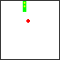

# fc64js - Tutorial - Snake (js)

## Eating the fruit

Detecting the fact that the snake's head (i.e. ```snake.body[0]```) occupies the same world coordinates as the ```fruit``` is very simple - both are instances of ```Vec2``` which offers a convenient ```equals``` function that returns ```true``` if both objects have equal ```x``` values and equal ```y``` values

Reacting to this collision scenario is also quite straightforward - we'll need to grow the ```snake.body``` by one segment (i.e. append a segment that occupies the same position as the current tip of the tail), and we'll need to move the fruit to another random position in the game world (to simulate the removal of the old one and creation of a new one)

Note that once the next ```snake.update``` is processed the newly added tip of the tail will be one space "behind" the penultimate segment as within ```update``` the new tail tip copies the next segments (identical) coordinates (i.e. no change to its location) while all other segments shuffle up by one position. Don't worry about the fact that the ```snake``` will have two ```body``` segments occupying the same space for one tick (a mere 60th of a second) - it doesn't affect gameplay

Here's the code we'll need to add:

```js
function romLoop() {
    ...
    snake.update();
    if (snake.body[0].equals(fruit)) {
      const tailTip = snake.body[snake.body.length - 1];
      snake.body.push(new Vec2(tailTip.x, tailTip.y));
      fruit.x = randomInt(0, 15);
      fruit.y = randomInt(0, 15);
    }
    ...
```

Now if we refresh the browser we'll see that the snake can eat the fruit, and when it does so it grows by one segment and a "new" piece of fruit is randomly placed in the world:



[Full code at this point](versions/v08.html)

[**Continue to the next step**](09.md)

---

Jump to step: [Introduction](readme.md) | [Project setup](01.md) | [Creating the snake](02.md) | [Drawing the snake](03.md) | [Moving the snake](04.md) | [Throttling the speed](05.md) | [Input handling](06.md) | [Placing the fruit](07.md) | Eating the fruit | [Losing the game](09.md) | [Managing state](10.md) | [Playing sound effects](11.md) | [Distribution](12.md)

