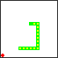
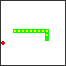

# fc64js - Tutorial - Snake (js)

## Losing the game

As things stand the snake can happily cross over itself without consequence:



In order to add an element of peril to the game, we should lose whenever the snake "bites" itself

We'll add an ```isDead``` function to our ```Snake``` class that returns ```true``` if the snake's head (```snake.body[0]```) occupies the same location as any of it it's other ```body``` segments:

```js
class Snake {
  ...
  isDead() {
    const head = this.body[0];
    for (let i = 1; i < this.body.length; i++) {
      if (this.body[i].equals(head)) {
        return true;
      }
    }
    return false;
  }
}
```

Then in ```romLoop```, after updating the snake's state, we'll check if the snake ```isDead```, and if it is reinitialise the rom by calling ```romInit``` (a simple means of restarting the game)

```js
function romLoop() {
    ...
    snake.update();
    if (snake.isDead()) {
      romInit();
    }
    ...
```

Now if we refresh the browser we'll see that the game restarts whenever we lose:



[Full code at this point](versions/v09.html)

[**Continue to the next step**](10.md)

---

Jump to step: [Introduction](readme.md) · [Project setup](01.md) · [Creating the snake](02.md) · [Drawing the snake](03.md) · [Moving the snake](04.md) · [Throttling the speed](05.md) · [Input handling](06.md) · [Placing the fruit](07.md) · [Eating the fruit](08.md) · Losing the game · [Managing state](10.md) · [Playing sound effects](11.md) · [Distribution](12.md)
