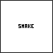

# fc64js - Tutorial - Snake (js)

## Managing state

Immediately restarting on losing serves a purpose but it feels a little abrupt. We can introduce the concept of states to improve our rom's flow. We'll add some nice extra features like a title screen and game over screen (with score display) while we're at it

We'll start our preparation by defining three possible rom `states` in an enum-like object:

```js
const states = {
  title: 0,
  playing: 1,
  gameOver: 2,
};
```

Next we'll add a global `state` variable to keep track of our current rom state (and leave it uninitialised for now). We'll also rename our existing `ticks` variable to `stateTicks` to better describe it's new intended purpose

```js
let state;
let stateTicks;
```

Then we'll initialise our newly added `state` variable by calling `changeState` from within `romInit`:

```js
function romInit() {
  changeState(states.title);
  ...
}
```

And finally we'll implement the `changeState` function - it simply needs to set the `state` to that which is provided, and reset the `stateTicks` counter:

```js
function changeState(newState) {
  state = newState;
  stateTicks = 0;
}
```

Now that we have simple state support in place we can modify our `romLoop` to make use of it

Other than the renaming of `ticks` to `stateTicks` the existing function body will remain largely untouched. If the `state` is `playing` we'll want to do everything pretty much as we did previously, but on losing we'll set the `state` to `gameOver` rather than reinitialise the rom

We'll also add some simple behaviour for when the `state` is either `title` or `gameOver`. Both cases are quite similar to each other - we'll call `drawText` to display some information, and if after a suitable delay any input is received (any button `isJustPressed`) we'll transition to the next logical `state` or reinitialise the rom

Here's our updated `romLoop`:

```js
function romLoop() {
  stateTicks++;
  clearGfx(COL_WHT);
  if (state == states.title) {
    drawText(22, 29, 'SNAKE', COL_BLK);
    if (stateTicks > 60 && (isJustPressed(BTN_U) || isJustPressed(BTN_D) || isJustPressed(BTN_L) || isJustPressed(BTN_R) || isJustPressed(BTN_A) || isJustPressed(BTN_B))) {
      changeState(states.playing);
    }
  } else if (state == states.playing) {
    handleGameplayInput();
    drawImage(fruit.x * 4, fruit.y * 4, 4, 4, imgFruit);
    if (stateTicks % 10 == 0) {
      snake.update();
      if (snake.isDead()) {
        changeState(states.gameOver);
      }
      if (snake.body[0].equals(fruit)) {
        const tailTip = snake.body[snake.body.length - 1];
        snake.body.push(new Vec2(tailTip.x, tailTip.y));
        fruit.x = randomInt(0, 15);
        fruit.y = randomInt(0, 15);
      }
    }
    snake.draw();
  } else if (state == states.gameOver) {
    drawText(24, 26, 'GAME', COL_BLK);
    drawText(24, 32, 'OVER', COL_BLK);
    drawText(16, 44, `SCORE:${snake.body.length - 3}`, COL_BLK);
    if (stateTicks > 60 && (isJustPressed(BTN_U) || isJustPressed(BTN_D) || isJustPressed(BTN_L) || isJustPressed(BTN_R) || isJustPressed(BTN_A) || isJustPressed(BTN_B))) {
      romInit();
    }
  }
}
```

If we refresh the browser we'll see a that we now have a more pleasing flow through our rom's lifecycle:



[Full code at this point](versions/v10.html)

[**Continue to the next step**](11.md)

---

Jump to step: [Introduction](readme.md) · [Project setup](01.md) · [Creating the snake](02.md) · [Drawing the snake](03.md) · [Moving the snake](04.md) · [Throttling the speed](05.md) · [Input handling](06.md) · [Placing the fruit](07.md) · [Eating the fruit](08.md) · [Losing the game](09.md) · Managing state · [Playing sound effects](11.md) · [Bug fixing](12.md) · [Distribution](13.md)
