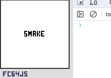
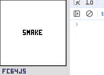

# fc64js - Tutorial - Snake (js)

## Bug fixing

In the [throttling the speed](05.md) step we opted to only update the snake once every ten ticks - this allowed us to have a more playable game

In the [input handling](06.md) step we opted to only change the snake's direction if it wasn't already moving on the requested axis - this helped guard against backtracking that would otherwise result in an immediate collision with itself. User input is handled on each tick

Can you spot the problem?

Try starting a new game, and while the snake is moving to the right press the down button then as quickly as possible press the left button - you'll be faced with a game over screen if you managed to press both buttons between two consecutive `snake.update()` calls

If we delve into what happened we'll see that there was a `snake.update()` call, then a `snake.tryDown()` call in response to the first button press which resulted in the snake's movement direction being set to down (as it was not moving on the y-axis at the time), then there was a `snake.tryLeft()` call in response to the second button press which resulted in the snake's movement direction being set to left (as it was no longer moving on the x-axis at the time - we had just changed that when we pressed the down button...), then on the next `snake.update()` call the snake moved forwards (i.e. the head moved one space left) and bumped into itself

We can prove this with some debug output - simply add `console.log(`U ${this.direction.x},${this.direction.y}`);` at the start of the `snake.update()` function body, and something similar at the start and end of `snake.tryDown()` and `snake.tryLeft()` to get a sequence of events and states printed to the console:



Moving the `handleGameplayInput()` call into the "once every ten ticks" block would solve this problem, but would result in a terrible user experience - try it if you like...

We're going to want to keep the input handling nice and responsive, so a different solution is needed. We'll add a `turning` variable to our `Snake` class, set it to true on successfully changing direction, prevent any further changes of direction whenever it is set to true, and reset it back to false on each `update()`

Code changes:

```js
class Snake {
  init() {
    ...
    this.turning = false;
  }
  ...
  update() {
    ...
    this.turning = false;
  }
  tryUp() {
    if (this.direction.y == 0 && !this.turning) {
      this.turning = true;
      ...
    }
  }
  tryDown() {
    if (this.direction.y == 0 && !this.turning) {
      this.turning = true;
      ...
    }
  }
  tryLeft() {
    if (this.direction.x == 0 && !this.turning) {
      this.turning = true;
      ...
    }
  }
  tryRight() {
    if (this.direction.x == 0 && !this.turning) {
      this.turning = true;
      ...
    }
  }
  ...
}
```

And here's the result (with the temporary debug console output still in place):



We can see that there was an attempt to immediately change direction to left having just changed it to down (input was handled and `snake.tryLeft()` was called), but the actual direction didn't change due to the `!this.turning` clause that has been added to the if statement (you could add `${this.turning}` to your debug output if you wanted to see this explicitly). Problem solved!

There's one other potential problem with the code as it stands - the fact that a new spawn position for the fruit could already be occupied by the snake. I don't have a problem with this so won't be making any changes, but you might choose to do so. You would simply need to check the proposed fruit position when randomizing, and retry if occupied. The probability of continually failing to find a free position sufficient times that it becomes noticeable to the player is vanishingly small, but not impossible. You might choose to keep track of the available locations, or keep track of the attempted locations, or fall back to allowing the fruit to spawn in an occupied space after a certain number of tries, etc. How (and if) you choose to approach this is left as an exercise for the reader :)

[Full code at this point](versions/v12.html)

[**Continue to the next step**](13.md)

---

Jump to step: [Introduction](readme.md) · [Project setup](01.md) · [Creating the snake](02.md) · [Drawing the snake](03.md) · [Moving the snake](04.md) · [Throttling the speed](05.md) · [Input handling](06.md) · [Placing the fruit](07.md) · [Eating the fruit](08.md) · [Losing the game](09.md) · [Managing state](10.md) · [Playing sound effects](11.md) · Bug fixing · [Distribution](13.md)
