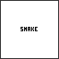
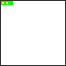
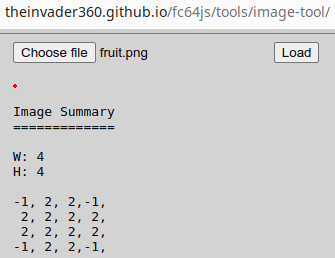
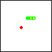
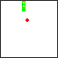
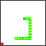

# fc64js - Tutorial - Snake (js)

Snake is a simple game that touches on a number of key game development concepts. It is a good project to work on in order to gain familiarity with fc64js

This tutorial walks you through:

* Initialising the rom
* Utilising the rom's main loop
* Clearing the screen
* Drawing rectangles
* Drawing images
* Drawing text
* Handling user input
* Managing game state
* Playing sound effects
* Distributing your game

Note: This fc64js tutorial is based on [this](https://wasm4.org/docs/tutorials/snake/goal/) wasm-4 tutorial

## Preview

Your finished game will end up looking like this:



[Finished code](../../../rom/game/snake/)

[Live preview](https://theinvader360.github.io/fc64js/rom/game/snake/)

## Project setup

The simplest way to get started would be to use inline javascript in a html file that references the latest version of the fc64js library hosted on github. Simply create a file named ```snake.html``` and in your text editor or IDE paste in the following boilerplate:

```html
<!DOCTYPE html>
<html>
  <head>
    <meta charset="utf-8" />
    <title>snake</title>
    <meta name="viewport" content="width=device-width, height=device-height, user-scalable=no, initial-scale=1, maximum-scale=1" />
    <script src="https://theinvader360.github.io/fc64js/lib/fc64.min.js"></script>
    <script>
      function romInit() {
        drawText(0, 0, 'Hello World!', COL_WHT);
      }

      function romLoop() {
      }
    </script>
  </head>
  <body>
  </body>
</html>
```

If you want to work offline simply download the latest version of the [fc64js library](https://github.com/TheInvader360/fc64js/blob/main/lib/fc64.min.js) and update the ```script src``` value accordingly

If you want to keep your html and javascript separate you can replace the second ```script``` element with e.g. ```<script src="./main.js"></script>``` and move the script content into a separate file (e.g. ```main.js```)

If all has been done correctly, when you open your ```snake.html``` file in a web browser you will be presented with a familiar greeting...


[Full code at this point](versions/v01.html)

## Creating the snake

What's a snake game without a snake? Let's add a class definition at the top of our script:

```js
class Snake {
  constructor() {
    this.body = [];
    this.direction = {};
  }
  init() {
    this.body = [new Vec2(2, 0), new Vec2(1, 0), new Vec2(0, 0)];
    this.direction = new Vec2(1, 0);
  }
}
```

fc64js provides a ```Vec2``` (two dimensional vector) class - it is comprised of ```x``` and ```y``` instance fields and various methods including ```equals``` that can be used to compare against other instances of ```Vec2```

We make good use of the ```Vec2``` class when modelling our ```Snake``` - it has a ```body``` comprised of an ordered list of ```Vec2``` objects (each one holding its own ```x``` and ```y``` coordinate values), and another ```Vec2``` object defines the current ```direction``` (on both the ```x``` and ```y``` axes)

The ```init``` function offers a means of initialising a ```Snake``` with some default values - three initial ```body``` segments (with the head at (2,0) and the tip of the tail at (0,0)), and a current ```direction``` of (1,0) (i.e. positive on the x-axis and neutral on the y-axis - so moving to the right)

[Full code at this point](versions/v02.html)

## Drawing the snake

Let's add a ```draw``` function to the ```Snake``` object:

```js
class Snake {
  ...
  draw() {
    for (const segment of this.body) {
      drawRectangle(segment.x * 4, segment.y * 4, 4, 4, COL_GRN, COL_YEL);
    }
    drawRectangle(this.body[0].x * 4, this.body[0].y * 4, 4, 4, COL_GRN, COL_GRN);
  }
}
```

When called, this function will loop over all segments of the ```Snake```'s ```body```, drawing a 4x4 pixel rectangle for each one, with the top left corner being at that segment's coordinates multiplied by 4 in each direction. The rectangles have a green edge and are filled with yellow. The ```Snake```'s "head" (```body[0]```) is a special case and is overdrawn with a green fill color to distinguish it from the rest of the body

Note that ```drawRectangle``` requires ```x```, ```y```, ```width```, ```height```, and ```edgeColor``` arguments to be provided. The final ```fillColor``` parameter is optional. If no ```fillColor``` is specified, only the edge is drawn, and whatever is "under" the rectangle will remain visible through its "transparent" inner area. All the arguments provided should be integers, and convenient constants that reference the default color palette are available (```COL_BLK```, ```COL_BLU```, ```COL_RED```, ```COL_MAG```, ```COL_GRN```, ```COL_CYN```, ```COL_YEL```, ```COL_WHT```)

Let's add a global variable (```snake```) to hold our ```Snake``` instance, instantiate and initialise it in ```romInit```, and clear the screen then ```draw``` the ```snake``` in the main ```romLoop``` (which is called each tick, ideally 60 times per second)

Note that ```clearGfx``` accepts an optional ```clearColor``` argument. If no ```clearColor``` value is provided the palette's zero index color is used by default (so in our case, using the default palette, that would be black)

```js
let snake;

function romInit() {
  snake = new Snake();
  snake.init();
}

function romLoop() {
  clearGfx(COL_WHT);
  snake.draw();
}
```

If we refresh the browser we'll see a snake with its head at coordinate (2,0) and its remaining body segments at (1,0) and (0,0):


[Full code at this point](versions/v03.html)

## Moving the snake

Let's add an ```update``` function to the ```Snake``` object:

```js
class Snake {
  ...
  update() {
    for (let i = this.body.length - 1; i > 0; i--) {
      this.body[i].x = this.body[i - 1].x;
      this.body[i].y = this.body[i - 1].y;
    }
    const head = this.body[0];
    head.x = wrap(head.x + this.direction.x, 0, 16);
    head.y = wrap(head.y + this.direction.y, 0, 16);
  }
}
```

On each ```update``` all segments of the snake's ```body``` excluding the head, working from the tip of the tail up towards the head, have their coordinates set to those of the next segment up. The head itself is positioned at its existing position plus whatever the current direction happens to be (so if moving right the head moves one position to the right, and so on). When positioning the head the new coordinates are screen wrapped using the ```wrap``` function provided by fc64js

Note that ```wrap``` requires ```value```, ```minExclusive```, and ```maxExclusive``` arguments to be provided. The first argument is the value we are wrapping (in this case an x or y coordinate), the second argument is the lowest acceptable value for that variable (in this case 0 - the top-left corner of our game world is positioned at (0,0)), and the third argument is the first value that exceeds the maximum acceptable value for that variable (in this case 16 - the bottom-right corner of our game world is positioned at (15,15))

We need to call ```update``` from ```romLoop```, updating the ```snake``` before we ```draw``` it:

```js
function romLoop() {
  clearGfx(COL_WHT);
  snake.update();
  snake.draw();
}
```

If we refresh the browser we'll see a snake that moves (very quickly) across the screen:


[Full code at this point](versions/v04.html)

## Throttling the speed

We can slow our ```snake``` down by updating its state less frequently. Rather than call ```update``` each time ```romLoop``` is called (i.e. updating on each tick, usually 60 times per second), we can keep track of the tick count and only call ```update``` every "n" ticks (e.g. every 10 ticks)

We'll add a global ```ticks``` variable for our counter, and initialise it with a value of 0. Then each time ```romLoop``` is called we'll increment the ```ticks``` count, and only ```update``` the snake if the ```ticks``` count is cleanly divisible by 10:

```js
let ticks = 0;

function romLoop() {
  ticks++;
  clearGfx(COL_WHT);
  if (ticks % 10 == 0) {
    snake.update();
  }
  snake.draw();
}
```

If we refresh the browser we'll see a snake that moves at a more reasonable speed:



[Full code at this point](versions/v05.html)

## Input handling

To help keep things readable, let's add a call out to a new ```handleGameplayInput``` function from ```romLoop```:

```js
function romLoop() {
  ticks++;
  clearGfx(COL_WHT);
  handleGameplayInput();
  ...
```

And let's create that ```handleGameplayInput``` function:

```js
function handleGameplayInput() {
  if (isJustPressed(BTN_U)) {
    snake.tryUp();
  }
  if (isJustPressed(BTN_D)) {
    snake.tryDown();
  }
  if (isJustPressed(BTN_L)) {
    snake.tryLeft();
  }
  if (isJustPressed(BTN_R)) {
    snake.tryRight();
  }
}
```

So on each tick we'll check if any of the buttons we are interested in (up/down/left/right) has just been pressed, and if so call the relevant method on our ```snake``` instance

Note that these button presses could have originated from a keyboard, touch controls, or physical gamepad - the ```isJustPressed``` method detects them all (there is no need to query various input devices separately). It is also worth noting that ```isPressed``` and ```isJustReleased``` functions are also available - we won't be needing them in this particular project but it could be useful information for future reference

Let's add the ```tryUp```, ```tryDown```, ```tryLeft```, and ```tryRight``` functions to the ```Snake``` object:

```js
class Snake {
  ...
  tryUp() {
    if (this.direction.y == 0) {
      this.direction.x = 0;
      this.direction.y = -1;
    }
  }
  tryDown() {
    if (this.direction.y == 0) {
      this.direction.x = 0;
      this.direction.y = 1;
    }
  }
  tryLeft() {
    if (this.direction.x == 0) {
      this.direction.x = -1;
      this.direction.y = 0;
    }
  }
  tryRight() {
    if (this.direction.x == 0) {
      this.direction.x = 1;
      this.direction.y = 0;
    }
  }
}
```

If trying to set the ```direction``` to up or down, first check that we're not already moving on the vertical plane (to avoid redundancy and prevent suicidal 180 degree u-turns), and provided we're not set the ```direction``` as requested (negative ```y``` value for up and positive ```y``` value for down as our coordinate system has its origin at the top left corner). Similarly, if trying to set the ```direction``` to left or right, we first check the current direction on the horizontal plane then if safe to do so go on to set the direction as requested

If we refresh the browser we'll see that we can now control our snake:


[Full code at this point](versions/v06.html)

## Placing the fruit

The aim of the game is to grow the snake as long as you can. The snake only grows when it eats some fruit, so let's add some fruit!

We could draw our fruit as a rectangle (or square), but there are times we want to draw something a little more detailed. fc64js offers various drawing functions - we could easily draw our fruit using a number of ```drawPixel``` calls, or a couple of ```drawRectangle``` calls, or a ```drawPattern``` call, but we're going to use ```drawImage``` instead

We're working with 4x4 pixel elements in our game, so fitting the fruit into the same constraints makes sense. I summoned up all of my artistic abilities and came up with this magnificent piece of programmer art:


Note that the image above is scaled up by a factor of 10 - the real image (that you can save a copy of) is here:


fc64js doesn't deal with image files directly, instead it works with arrays of integers where each value references a color in the palette. Up to eight colors can be defined in a palette, and the default values for indices 0 to 7 are black, blue, red, magenta, green, cyan, yellow, and white. For each pixel in the ```drawImage``` bounds (a rectangle defined by ```x```, ```y```, ```width```, and ```height``` parameters), a value is pulled from the provided ```pixelColors``` array and drawn to screen via internal calls to ```drawPixel```. Images are read in the same order as the screen is drawn i.e. from left to right and top to bottom. Any attempt to draw a pixel with a color value outside the valid 0 to 7 range results in no pixel being drawn (in effect a transparent pixel) - by convention -1 is used for intentionally transparent pixels

Armed with this knowledge it should be fairly straightforward to translate our ```fruit.png``` into a ```pixelColors``` array suitable for use by the ```drawImage``` function. Translating larger and more complex images would soon become tedious, and that's where the fc64js [image-tool](https://theinvader360.github.io/fc64js/tools/image-tool/) comes in useful - simply upload a png file (e.g. your previously saved ```fruit.png```) to generate fc64js friendly ```pixelColor``` values:

[](https://theinvader360.github.io/fc64js/tools/image-tool/)

To draw our fruit image in the top left corner of the screen we'd simply plug those values (and ```x``` and ```y``` screen coordinate values of zero) into a ```drawImage``` call like so:

```js
drawImage(0, 0, 4, 4, [-1, 2, 2, -1, 2, 2, 2, 2, 2, 2, 2, 2, -1, 2, 2,-1]);
```

Bringing all that into our game, let's first define an ```imgFruit``` constant to hold our pixel data (not strictly necessary, but it helps make the code more readable):

```js
const imgFruit = [
  -1, 2, 2,-1,
   2, 2, 2, 2,
   2, 2, 2, 2,
  -1, 2, 2,-1,
];
```

Then we'll add a global variable (```fruit```) to hold another ```Vec2``` instance that records the fruit's location within the game world, and initialise it in ```romInit``` to any valid location (i.e. anywhere between world coordinates (0,0) and (15,15) inclusive):

```js
let fruit;

function romInit() {
  ...
  fruit = new Vec2(randomInt(0, 15), randomInt(0, 15));
}
```

Finally, let's add a ```drawImage``` call to ```romLoop``` that draws our fruit at the relevant screen coordinates:

```js
function romLoop() {
  ...
  handleGameplayInput();
  drawImage(fruit.x * 4, fruit.y * 4, 4, 4, imgFruit);
  ...
```

If we refresh the browser we'll see that we now have fruit, but there is no interaction between it and the snake:



[Full code at this point](versions/v07.html)

## Eating the fruit

Detecting the fact that the snake's head (i.e. ```snake.body[0]```) occupies the same world coordinates as the ```fruit``` is very simple - both are instances of ```Vec2``` which offers a convenient ```equals``` function that returns ```true``` if both objects have equal ```x``` values and equal ```y``` values

Reacting to this collision scenario is also quite straightforward - we'll need to grow the ```snake.body``` by one segment (i.e. append a segment that occupies the same position as the current tip of the tail), and we'll need to move the fruit to another random position in the game world (to simulate the removal of the old one and creation of a new one)

Note that once the next ```snake.update``` is processed the newly added tip of the tail will be one space "behind" the penultimate segment as within ```update``` the new tail tip copies the next segments (identical) coordinates (i.e. no change to its location) while all other segments shuffle up by one position. Don't worry about the fact that the ```snake``` will have two ```body``` segments occupying the same space for one tick (a mere 60th of a second) - it doesn't affect gameplay

Here's the code we'll need to add:

```js
function romLoop() {
    ...
    snake.update();
    if (snake.body[0].equals(fruit)) {
      const tailTip = snake.body[snake.body.length - 1];
      snake.body.push(new Vec2(tailTip.x, tailTip.y));
      fruit.x = randomInt(0, 15);
      fruit.y = randomInt(0, 15);
    }
    ...
```

Now if we refresh the browser we'll see that the snake can eat the fruit, and when it does so it grows by one segment and a "new" piece of fruit is randomly placed in the world:



[Full code at this point](versions/v08.html)

## Losing the game

As things stand the snake can happily cross over itself without consequence:



In order to add an element of peril to the game, we should lose whenever the snake "bites" itself

We'll add an ```isDead``` function to our ```Snake``` class that returns ```true``` if the snake's head (```snake.body[0]```) occupies the same location as any of it it's other ```body``` segments:

```js
class Snake {
  ...
  isDead() {
    const head = this.body[0];
    for (let i = 1; i < this.body.length; i++) {
      if (this.body[i].equals(head)) {
        return true;
      }
    }
    return false;
  }
}
```

Then in ```romLoop```, after updating the snake's state, we'll check if the snake ```isDead```, and if it is reinitialise the rom by calling ```romInit``` (a simple means of restarting the game)

```js
function romLoop() {
    ...
    snake.update();
    if (snake.isDead()) {
      romInit();
    }
    ...
```

Now if we refresh the browser we'll see that the game restarts whenever we lose:


[Full code at this point](versions/v09.html)

## Managing game state

Immediately restarting on losing serves a purpose but it feels a little abrupt. We can introduce the concept of states to improve our rom's flow. We'll add some nice extra features like a title screen and game over screen (with score display) while we're at it

We'll start our preparation by defining three possible rom ```states``` in an enum-like object:

```js
const states = {
  title: 0,
  playing: 1,
  gameOver: 2,
};
```

Next we'll add a global ```state``` variable to keep track of our current rom state (and leave it uninitialised for now). We'll also rename our existing ```ticks``` variable to ```stateTicks``` to better describe it's new intended purpose

```js
let state;
let stateTicks;
```

Then we'll initialise our newly added ```state``` variable by calling ```changeState``` from within ```romInit```:

```js
function romInit() {
  changeState(states.title);
  ...
}
```

And finally we'll implement the ```changeState``` function - it simply needs to set the ```state``` to that which is provided, and reset the ```stateTicks``` counter:

```js
function changeState(newState) {
  state = newState;
  stateTicks = 0;
}
```

Now that we have simple state support in place we can modify our ```romLoop``` to make use of it

Other than the renaming of ```ticks``` to ```stateTicks``` the existing function body will remain largely untouched. If the ```state``` is ```playing``` we'll want to do everything pretty much as we did previously, but on losing we'll set the ```state``` to ```gameOver``` rather than reinitialise the rom

We'll also add some simple behaviour for when the ```state``` is either ```title``` or ```gameOver```. Both cases are quite similar to each other - we'll call ```drawText``` to display some information, and if after a suitable delay any input is received (any button ```isJustPressed```) we'll transition to the next logical ```state``` or reinitialise the rom

Here's our updated ```romLoop```:

```js
function romLoop() {
  stateTicks++;
  clearGfx(COL_WHT);
  if (state == states.title) {
    drawText(22, 29, 'SNAKE', COL_BLK);
    if (stateTicks > 60 && (isJustPressed(BTN_U) || isJustPressed(BTN_D) || isJustPressed(BTN_L) || isJustPressed(BTN_R) || isJustPressed(BTN_A) || isJustPressed(BTN_B))) {
      changeState(states.playing);
    }
  } else if (state == states.playing) {
    handleGameplayInput();
    drawImage(fruit.x * 4, fruit.y * 4, 4, 4, imgFruit);
    if (stateTicks % 10 == 0) {
      snake.update();
      if (snake.isDead()) {
        changeState(states.gameOver);
      }
      if (snake.body[0].equals(fruit)) {
        const tailTip = snake.body[snake.body.length - 1];
        snake.body.push(new Vec2(tailTip.x, tailTip.y));
        fruit.x = randomInt(0, 15);
        fruit.y = randomInt(0, 15);
      }
    }
    snake.draw();
  } else if (state == states.gameOver) {
    drawText(24, 26, 'GAME', COL_BLK);
    drawText(24, 32, 'OVER', COL_BLK);
    drawText(16, 44, `SCORE:${snake.body.length - 3}`, COL_BLK);
    if (stateTicks > 60 && (isJustPressed(BTN_U) || isJustPressed(BTN_D) || isJustPressed(BTN_L) || isJustPressed(BTN_R) || isJustPressed(BTN_A) || isJustPressed(BTN_B))) {
      romInit();
    }
  }
}
```

If we refresh the browser we'll see a that we now have a more pleasing flow through our rom's lifecycle:


[Full code at this point](versions/v10.html)

## Playing sound effects

We can further improve our rom by adding some simple sound effects

The ```beep``` function offers a convenient means of triggering sounds - it requires ```frequency```, ```duration```, and ```force``` arguments to be provided (the first two being integers and the last being a boolean). The ```frequency``` parameter is the beep's frequency (measured in hertz), the ```duration``` parameter is how long the beep should play for (measured in ticks), and ```force``` determines whether or not the beep should override any currently playing beep or not

A short and relatively high pitched beep suits the positive event of eating a piece of fruit, and a longer relatively low pitched beep suits the negative event of losing

We'll simply add calls to ```beep``` (with appropriate arguments set) at the relevant points in ```romLoop```:

```js
function romLoop() {
      ...
      if (snake.isDead()) {
        beep(280, 15, true);
        changeState(states.gameOver);
      }
      if (snake.body[0].equals(fruit)) {
        beep(1000, 5, true);
        ...
```

[Full code at this point](versions/v11.html)

## Distributing your game

Now that you have a finished rom you can freely distribute it as you please

You are free to include the [fc64js library](https://github.com/TheInvader360/fc64js/blob/main/lib/fc64.min.js) in your distributions, and it is strongly recommended that you do so (rather than linking directly to github in your html file)

You might like to deploy somewhere online - [github pages](https://theinvader360.github.io/fc64js/rom/game/snake/) and [itch.io](https://theinvader360.itch.io/fc64js-snake) are two good options

Finally, I'm really interested in seeing fc64js roms created by others - please get in touch to let me know about your creations!
