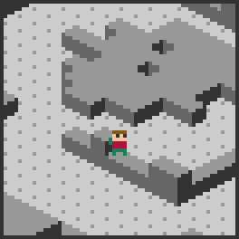

# Isometric (fc64js demo rom)

[](https://theinvader360.github.io/fc64js/rom/demo/isometric/)

Isometric demo for the [fc64js](https://github.com/TheInvader360/fc64js) fantasy console

Loosely inspired by [Ant Attack](https://en.wikipedia.org/wiki/Ant_Attack)

[Live preview](https://theinvader360.github.io/fc64js/rom/demo/isometric/)

## Overview

The player rotates at a fixed 90 degrees (press L/R), and movement is limited to full grid cell steps forwards or backwards (press U/D)

The player can hop up or down a single block's height per move

The view can be toggled between isometric and orthographic modes (press A/B)

The isometric view is composed of a number of overlaid images, mostly the 8x8 pixel ```imgIsoBlock``` - here's an example scaled up by a factor of 5:


The view is drawn one ```levelMap``` tile at a time. Each tile's stack is comprised of either an ```imgIsoFloor``` or a stack of 1 to 6 ```imgIsoBlock```s (overlaying each other with a y-axis offset), plus an optional occupying ```entity``` on top. When these tile stacks are drawn over each other in the correct order, a third person isometric view is formed:



Here is the same scene being slowly drawn one tile stack at a time:


There's a simple illustration of the isometric tile draw order algorithm available [here](docs/isometric-draw-order-algorithm.html)

## Credits

* Code, sprites, and palette by TheInvader360
* Concept and level design inspired by Sandy White's [Ant Attack](http://sandywhite.co.uk/fun/ants/)
* Entity sprites inspired by Min's [8x8 Roguelike Sprites](https://opengameart.org/content/8x8-rogue-like-charenemiestiles)
